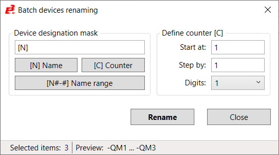

# E3.Series powershell scripts

## Batch Device Renaming 

**Batch Device Renaming** is a PowerShell script for batch processing used to rename
selected devices in E3.Series to save time and reduce the amount of work involved.

You may find details of the script in the PDF help file 
[BatchDeviceRenaming-En.pdf](BatchDeviceRenaming/BatchDeviceRenaming-En.pdf)
